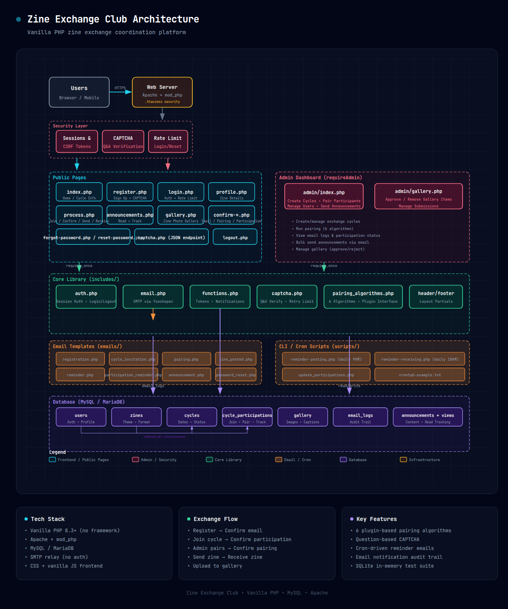

# Zine Exchange Club

A zine exchange coordination system built in vanilla PHP 8.3+. This platform allows zine creators to register, participate in exchange cycles, get paired with other participants, and track the exchange process.

## Features

- **User Registration**: Users can register with their personal information
- **Email Confirmation**: Email verification for new registrations
- **Cycle Management**: Administrators can create exchange cycles
- **Plugin-Based Pairing**: 6 pairing algorithms including random, country-based, zine-type, and geographic proximity matching
- **Process Tracking**: Participants can track their progress through each exchange cycle
- **Email Notifications**: Automated emails at each stage of the process
- **Gallery**: Photo gallery of received zines
- **Admin Dashboard**: Complete admin interface for managing users, cycles, monitoring progress, and manual pairing of leftover participants
- **Reminder System**: Crontab scripts to remind users about posting and receiving zines
- **Mobile Responsive**: Airy, modern design that works on all devices
- **Bot Protection**: Question-based captcha on registration, login, and password reset forms with configurable retry limit
- **Dry-Run Simulation**: CLI script to preview pairing results before committing

## Architecture



*An interactive HTML version is available at
[`zine-exchange-club-architecture.html`](zine-exchange-club-architecture.html) —
open it in a browser for the full detail.*

The system follows a classic LAMP-stack architecture:

- **Web Layer**: Apache with `.htaccess` security headers, file protections, HTTPS redirect, Content-Security-Policy, and URL rewriting
- **Security Layer**: PHP sessions with CSRF tokens, `session_regenerate_id()` on login, question-based CAPTCHA, IP-rate-limited login/reset forms, stored XSS prevention via `ENT_QUOTES`, SMTP dot-stuffing, and country-normalized pairing
- **Public Pages**: User-facing PHP pages for registration, login, cycle participation, exchange tracking, gallery, and announcements
- **Admin Dashboard**: Admin-only pages for cycle management, participant pairing (6 plugin-based algorithms with country normalization), manual pairing of leftover participants, announcement broadcasting, and gallery moderation
- **Core Library**: Shared PHP includes for authentication (`auth.php`), SMTP email (`email.php` via `fsockopen`), pairing algorithms (`pairing_algorithms.php`), CAPTCHA verification, and utility functions
- **Background Services**: Cron-driven CLI scripts for posting/receiving reminders and batch updates
- **Email Templates**: HTML email templates for every stage of the exchange cycle
- **Database**: MySQL/MariaDB with 7 tables (`users`, `zines`, `cycles`, `cycle_participations`, `gallery`, `email_logs`, `announcements` + `announcement_views`)

## Requirements

- PHP 8.3 or higher
- MySQL 5.7 or higher / MariaDB 10.2 or higher
- SMTP relay server (configured in config.php)
- Web server (Apache recommended)

## Installation

### 1. Database Setup

Create a MySQL database and import the schema:

```bash
mysql -u your_username -p zine_exchange_club < schema.sql
```

Or manually run the SQL commands in `schema.sql`.

### 2. Configuration

Copy `config.php.sample` to `config.php` and update the following settings:

```php
// Database configuration
define('DB_HOST', 'localhost');
define('DB_NAME', 'zine_exchange_club');
define('DB_USER', 'your_db_user');
define('DB_PASS', 'your_db_password');

// Email/SMTP configuration
define('SMTP_HOST', '192.168.233.9');
define('SMTP_PORT', 25);
define('SMTP_FROM', 'zine@zineexchangeclub.org');
define('SMTP_FROM_NAME', 'Zine Exchange Club');
define('SITE_URL', 'https://yourdomain.com');

// Site configuration
define('SITE_TITLE', 'Zine Exchange Club');
define('CONTENT_TYPE', 'zine'); // Type of content exchanged: 'zine' or 'postcard'

// Pairing algorithm configuration
define('PAIRING_ALGORITHM', 'random'); // Options: 'country_priority', 'random', 'sequential', 'zine_type', 'country_zine_type', 'geographic_proximity'

// Admin configuration
define('ADMIN_EMAIL', 'admin@zineexchangeclub.org');

// Captcha configuration
define('CAPTCHA_MAX_RETRIES', 3); // Max failed attempts before blocking form
```

### 3. File Permissions

Set appropriate permissions:

```bash
# Make scripts executable
chmod +x scripts/*.php

# Make uploads directory writable
mkdir uploads
chmod 755 uploads
```

### 4. Create Admin User

You'll need to manually create an admin user in the database. Run this SQL:

```sql
INSERT INTO users (name, email, password, postal_address, accepts_adult_zines, country, is_admin, email_confirmed)
VALUES (
    'Admin Name',
    'admin@zineexchangeclub.org',
    '$2y$10$your_hashed_password_here',
    'Admin Address',
    0,
    'Your Country',
    1,
    1
);
```

Generate a password hash using PHP:
```php
<?php
echo password_hash('your_password', PASSWORD_DEFAULT);
```

### 5. Configure Crontab

Set up the reminder scripts in your crontab:

```bash
crontab -e
```

Add these lines (adjust paths as needed):

```
0 9 * * * /usr/bin/php /path/to/zineexchangeclub.org/scripts/reminder-posting.php
0 10 * * * /usr/bin/php /path/to/zineexchangeclub.org/scripts/reminder-receiving.php
```

### 6. Web Server Configuration

Ensure your web server is configured to serve PHP files. For Apache, ensure mod_php is enabled.

The `.htaccess` file includes:
- Security headers (X-Content-Type-Options, X-Frame-Options, CSP, Referrer-Policy)
- Content-Security-Policy restricting script/style sources
- Directory browsing disabled
- Protection of sensitive files (config.php, schema.sql, captcha.json, .htaccess)
- Protection of includes/ directory from direct access
- PHP execution blocked in uploads/ directory
- HTTPS redirect (uncomment in production)
- Compression enabled
- Upload size limits

## Testing

The test suite uses plain PHP CLI scripts — no PHPUnit required. Each test script outputs `[PASS]` or `[FAIL]` lines; a run is green when every line is `[PASS]`.

### Requirements

- PHP 8.3+ (CLI)
- No database or SMTP server needed — tests use SQLite in-memory
- Xdebug 3.2+ installed (for coverage reports)

### Running Tests

```bash
# Full suite
for f in tests/*.php; do php "$f"; done

# Individual test file
php tests/AuthTest.php
php tests/CaptchaTest.php

# Coverage report (Xdebug required)
XDEBUG_MODE=coverage php tests/run_coverage.php
```

### Test Architecture

- `tests/bootstrap.php` creates a temporary SQLite-based `config.php` in the project root (config.php is in `.gitignore`, so this is safe) and provides assertion helpers (`assert_equal`, `assert_true`, `assert_throws`).
- Database-dependent tests use an in-memory SQLite database with the full schema created by `createTestSchema()`.
- Session-dependent tests manipulate `$_SESSION` directly.
- Pairing algorithm tests verify two-way symmetric pairings, edge cases (0/1 participants, unconfirmed users), algorithm-specific behaviour, and odd-count logging.
- Email template tests assert HTML content, variable interpolation, and XSS escaping without sending emails.

## Directory Structure

```
zineexchangeclub.org/
├── admin/
│   ├── gallery.php           # Gallery management (admin)
│   └── index.php              # Admin dashboard + manual pairing UI
├── css/
│   └── style.css             # Main stylesheet
├── emails/                   # HTML email templates
│   ├── announcement.php
│   ├── cycle_invitation.php
│   ├── migration_notification.php
│   ├── pairing.php
│   ├── participation_reminder.php
│   ├── password_reset.php
│   ├── registration.php
│   ├── reminder.php
│   └── zine_posted.php
├── includes/
│   ├── auth.php              # Authentication (session, login, CSRF, tokens)
│   ├── captcha.php           # Captcha question selection and verification
│   ├── email.php             # SMTP email sending and template rendering
│   ├── footer.php            # Shared page footer
│   ├── functions.php         # Announcement helper functions
│   ├── header.php            # Shared page header
│   └── pairing_algorithms.php # 6 algorithms + factory + country normalization
├── js/
│   └── captcha.js            # Frontend captcha verification with AJAX
├── scripts/
│   ├── crontab-example.txt   # Example crontab configuration
│   ├── reminder-posting.php  # Reminder for posting zines
│   ├── reminder-receiving.php # Reminder for receiving zines
│   ├── simulate_pairing.php  # Dry-run pairing simulation (no DB writes)
│   └── update_participations.php
├── tests/                    # Test suite (plain PHP CLI scripts)
│   ├── AuthTest.php          # Authentication function tests
│   ├── bootstrap.php         # Shared test infrastructure + SQLite helper
│   ├── CaptchaTest.php       # Captcha verification tests
│   ├── EmailTemplatesTest.php # Email template rendering tests
│   ├── FunctionsTest.php     # Announcement/pairing function tests
│   ├── PairingAlgorithmsTest.php # All 6 pairing algorithm tests
│   └── run_coverage.php      # Xdebug coverage wrapper
├── uploads/                  # Gallery images
├── .htaccess                 # Apache configuration (security, rewrite, CSP)
├── captcha.json              # Captcha question/answer pairs
├── captcha.php               # Captcha JSON API endpoint
├── config.php                # Configuration (or auto-generated for tests)
├── config.php.sample         # Sample production configuration
├── schema.sql                # Database schema
├── *.php                     # Public pages (index, login, register, process, etc.)
└── README.md                 # This file
```

## How It Works

### The Exchange Process

1. **Registration**: Users sign up and describe their zine (theme, format, construction type)
2. **Cycle Creation**: Admin creates a new exchange cycle with a start date
3. **Invitation**: Existing users receive email invitations to participate
4. **Confirmation**: Users confirm their participation for the cycle
5. **Pairing**: Admin pairs confirmed participants using the selected algorithm (or simulate first with the dry-run script)
6. **Pairing Notification**: Users receive emails with their partner's address
7. **Sending**: Users send their zine and report it on the site
8. **Notification**: Recipients are notified when a zine is posted to them
9. **Receiving**: Users report when they receive their zine
10. **Gallery**: Users can upload photos of received zines to the gallery

### Pairing Algorithms

The system features a plugin-based pairing system with 6 algorithms. Configure the active algorithm in `config.php`:

```php
define('PAIRING_ALGORITHM', 'geographic_proximity');
```

#### Available Algorithms:

1. **Random** (Default)
   - Completely random pairing of all participants
   - Maximum variety in exchanges

2. **Country Priority**
   - Groups participants by country (with alias normalization — "USA", "Us of A", "United States of America" are all treated as the same country)
   - Pairs within the same country first, cross-country for leftovers
   - Logs warning when odd participant count leaves someone unpaired

3. **Sequential**
   - Pairs participants in order of their registration date
   - Predictable pairing order

4. **Zine Type**
   - Groups participants by zine format (folded, stapled, bound, digital, other)
   - Prioritizes pairing similar zine types
   - Cross-format pairing for leftovers

5. **Country + Zine Type**
   - Highest priority: Same country AND same zine format
   - Falls back to cross-group pairing
   - Most specific matching algorithm

6. **Geographic Proximity**
   - Same country = 3 points, same region (continent) = 2 points, cross-region = 0 points
   - Greedy matching with random-restart optimization (50–500 iterations depending on participant count)
   - **Zine format tiebreaker**: when two candidates have equal geographic score, prefers matching zine format
   - **Country normalization**: "Danmark" → "Denmark", "Deutschland" → "Germany" before matching
   - Logs pairing quality stats (same-country / same-region / cross-region counts)
   - Falls back to best greedy result when all pairs are cross-region (avoids blind random fallback)

#### Adding New Algorithms:
New pairing algorithms can be added by implementing the `PairingAlgorithm` interface in `includes/pairing_algorithms.php` and registering in the factory.

#### Dry-Run Simulation:
Preview what each algorithm would produce without modifying the database or sending emails:

```bash
# Simulate active cycles with configured algorithm
php scripts/simulate_pairing.php

# Simulate all 6 algorithms across all cycles
php scripts/simulate_pairing.php --all

# Simulate a specific cycle with a specific algorithm
php scripts/simulate_pairing.php --cycle=5 --algo=geographic_proximity
```

#### Manual Pairing (Admin):
After auto-pairing, if an odd participant count left users unpaired, the admin dashboard (`admin/index.php`) shows dropdowns to manually select and pair leftover users. This appears in the Active Cycles table when `pairing_done = 1`.

### Country Name Normalization

All country-aware algorithms (Country Priority, Country + Zine Type, Geographic Proximity) normalize country names via a 69-entry alias map before comparison. This ensures variants like these are treated as the same country:

| Variant | Canonical |
|---------|-----------|
| `"Us of A"`, `"USA"`, `"U.S.A."`, `"United States of America"` | `united states` |
| `"England"`, `"Scotland"`, `"Wales"`, `"Great Britain"` | `united kingdom` |
| `"Danmark"` | `denmark` |
| `"Deutschland"` | `germany` |
| `"Nippon"` | `japan` |
| `"Brasil"` | `brazil` |

### Email Notifications

The system sends emails at these stages:
- Registration confirmation
- Cycle invitation
- Pairing notification
- Zine posted notification
- Reminders for posting (2 weeks after pairing, then weekly)
- Reminders for receiving (2 weeks after posting, then weekly)

### SMTP Configuration

The custom SMTP implementation (via `fsockopen`) includes:
- Dot-stuffing to prevent SMTP injection in email bodies
- CRLF sanitization on To/Subject headers
- Configurable host and port via `config.php`

## Security Considerations

- Passwords are hashed using PHP's `password_hash()` with bcrypt
- `session_regenerate_id(true)` called on every successful login (prevents session fixation)
- Session cookie cleared on logout via `setcookie()` with past expiry
- CSRF tokens validated on all POST requests
- Email confirmation required for registration
- Rate limiting on login (5 attempts per 15 min) and password reset (3 per 15 min)
- Question-based captcha on registration, login, and forgot-password forms
- Captcha answers stored in `captcha.json` protected via `.htaccess` from direct access
- Captcha verification is server-side authoritative (session flag, not hidden fields)
- Session cookie marked `HttpOnly`, `Secure`, and `SameSite=Strict`
- HTTPS redirect enabled (uncomment in production)
- Content-Security-Policy header restricts inline scripts
- All SQL queries use prepared statements (no SQL injection)
- All HTML output escaped with `htmlspecialchars($value, ENT_QUOTES, 'UTF-8')`
- File uploads use MIME-derived extensions (not user-supplied filenames)
- Uploaded filenames are random (via `bin2hex(random_bytes(16))`)
- PHP execution blocked in `uploads/` directory via `.htaccess`
- `includes/` directory protected from direct access via `RewriteRule`
- Error messages are logged server-side, generic messages shown to users
- `declare(strict_types=1)` on every PHP source file
- SMTP body dot-stuffed to prevent early DATA termination
- Confirmation tokens never rendered in HTML (server-side lookup via session)

## Customization

### Content Type

The site uses `CONTENT_TYPE` to determine the terminology throughout all pages and emails. Set it in `config.php`:
```php
define('CONTENT_TYPE', 'zine'); // Options: 'zine' or 'postcard'
```
This changes all user-facing references from "zine" to "postcard" (e.g., "zine gallery" → "postcard gallery", "send your zine" → "send your postcard").

### Site Title

Change the site title by updating the `SITE_TITLE` constant in `config.php`:
```php
define('SITE_TITLE', 'Your Zine Exchange Name');
define('CONTENT_TYPE', 'zine');
```
This will update the site name throughout all pages and emails.

### Announcement Management

Administrators can send announcements to all registered members with the following options:

- **Automatic Sending**: When creating or editing an announcement, check "Send to all registered users" to immediately email all confirmed users
- **Manual Sending**: For announcements that weren't sent initially, administrators can click "Send to All Users" button next to each announcement
- **Email Tracking**: The system tracks which announcements have been sent to prevent duplicate emails
- **Email Content**: Uses the site title from `SITE_TITLE` configuration for consistent branding

### Styling

Edit `css/style.css` to customize appearance. The design uses:
- Modern, airy layout
- Mobile-first responsive design
- Clean typography
- Subtle animations

### Email Templates

Email templates are in `emails/` as individual PHP files rendered by `renderEmailTemplate()`. Customize the HTML to match your branding.

## Troubleshooting

### Emails Not Sending

- Verify SMTP server is accessible
- Check PHP error logs
- Ensure SMTP_HOST and SMTP_PORT are correct
- Test SMTP connection manually

### File Uploads Failing

- Ensure `uploads/` directory exists and is writable
- Check PHP upload_max_filesize and post_max_size settings
- Verify file permissions
- Only JPEG, PNG, GIF, and WebP images are accepted

### Session Issues

- Check session save path permissions
- Ensure session cookie settings are correct
- Verify PHP session configuration

## License

This project is free software: you can redistribute it and/or modify it under the terms of the GNU General Public License as published by the Free Software Foundation, either version 3 of the License, or (at your option) any later version.

See the [LICENSE](LICENSE) file for the full license text.

## Support

For issues or questions, contact the administrator at the email configured in `config.php`.
